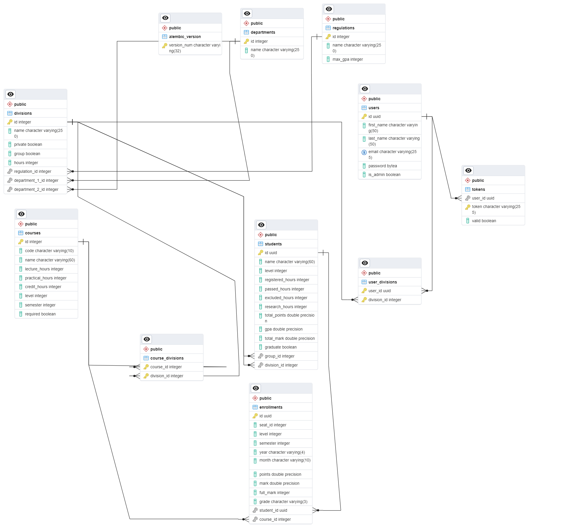
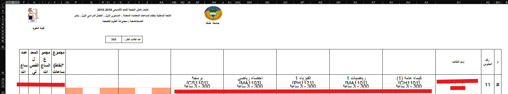
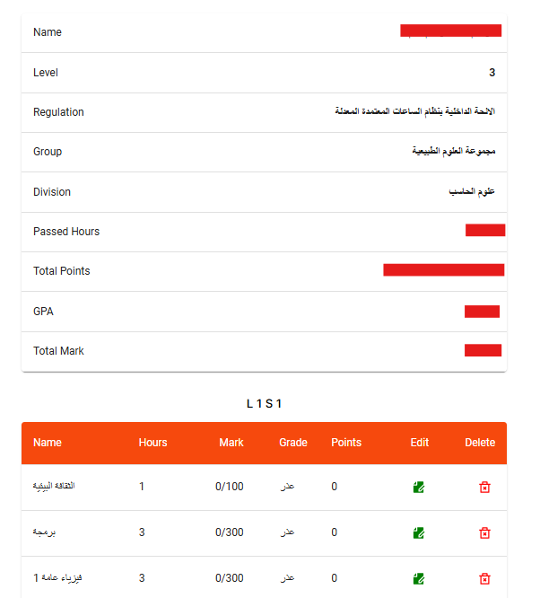

# GPAXL
Educational Management System with some data engineering features


## Project Overview
This project is considered with handling all data concerned with the students throughout their college lifetime beginning from when they register untill graduation. this project using FastAPI which is a python framework and follow app-based structure like Django.

## Database Design
The following ERD describes the database design



### we have 8 main tables:
- *regulations*: regulations to be followed in the college
- *departments*: departments of the college
- *divisions*: divisions are specialized departments that follow some department
- *courses*: courses of a regulation
- *students*: students of the college
- *enrollments*: enrollments registered for the students
- *users*: users to use the system
- *tokens*: corresponding to users

### we also have 2 secondary tables
- *user_divisions*: represents many to many relation between user and division
- *course_divisions*: represents many to many relation between course and division

> the alembic version table considered with migrations


## Project Structure
As we mentioned previously in the overview our project structure is app-based.
In this section we'll explain each app and the config of the project.

### migrations & alembic.ini
those are concerned with migrations and config of alembic package that's used to apply migrations on the database

### main.py
contains the main app the its configurations. \
this following function includes all routers of the registered apps in the main application
```py
for app_name in settings.APPS:
	module_path = f"{app_name}.router"  # Adjust path as needed
	module = import_module(module_path)
	router = getattr(module, f"{app_name}_router", None)
	if app_name in ['authentication', 'user']:
		app.include_router(router, prefix='/accounts', tags=['authentication'])
		continue
	if app_name == 'upload':
		app.include_router(router, prefix='/data', tags=['uploads'])
		continue
	app.include_router(router, prefix=f'/{app_name}s', tags=[f'{app_name}s'])
```

### config.py
contains the main settings of the application to be read from the environment variables, the logging settings and a function to combine all model base as follows:
```py
def get_base():
    models = []
    for app in settings.APPS:
        try:
            module = import_module(f'{app}.models')
            logging.info(f'Successfully imported {app}.models')
        except Exception as e:
            logging.warning(f'\tFailed to import {app}.models: {e}')
            continue
        base = getattr(module, 'Base', None)
        if base is not None:
            models.append(base)
        else:
            logging.info(f'No Base in {app}.models')

    if not models:
        logging.error('No models found with a Base class.')
        return None

    return models[-1]
```

### database directory
contains all needed database clients: Sync Client, Async Client and Test Client to be used in API testing containd the *tests* directory.

### tests
contains API tests and testing configurations to be used by pytest package

### generics
contains generic classes to be used directly or as a base class to more specific classes in the system like generic mixins, exceptions and permissions

### other apps
each app contains 4 file:
- models.py \
contains orm models \
doesn't depend on other layers
- schemas.py \
contains data transfer objects \
doesn't depend on other layers
- handler.py \
contains implementation of main CRUD operations and some more methods for required processes if needed \
depends on schemas and models
- router.py \
contain the main router to be included in the app and the endpoints defined within it \
depends on handler

### upload app
this app has 2 differences from other apps: \
- first it have one more file that called xl_handler \
this file contains pandas methods conerned with handling uploaded Excel file using some data engineering technique called Extract Transform Load (ETL) to extract the data from the uploaded file, reforming that data to a proper format for storage and calculations and then load the data inside the system and there are 2 pictures shows the transformation: \
raw data before transformation:

data after cleanup and transformation:


- second difference is the handler.py file doesn't contain normal CRUD operations like other apps, but instead it contains handlers for uploading the Excel files, apply calculations on the extracted dataand finally store the loaded data.
